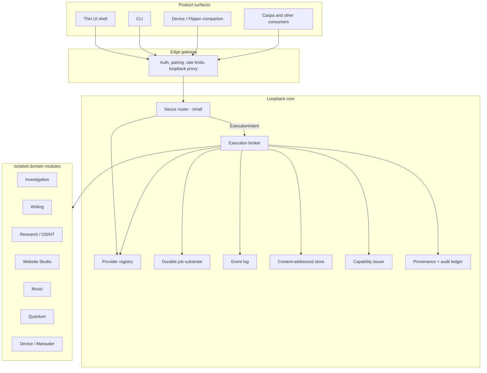
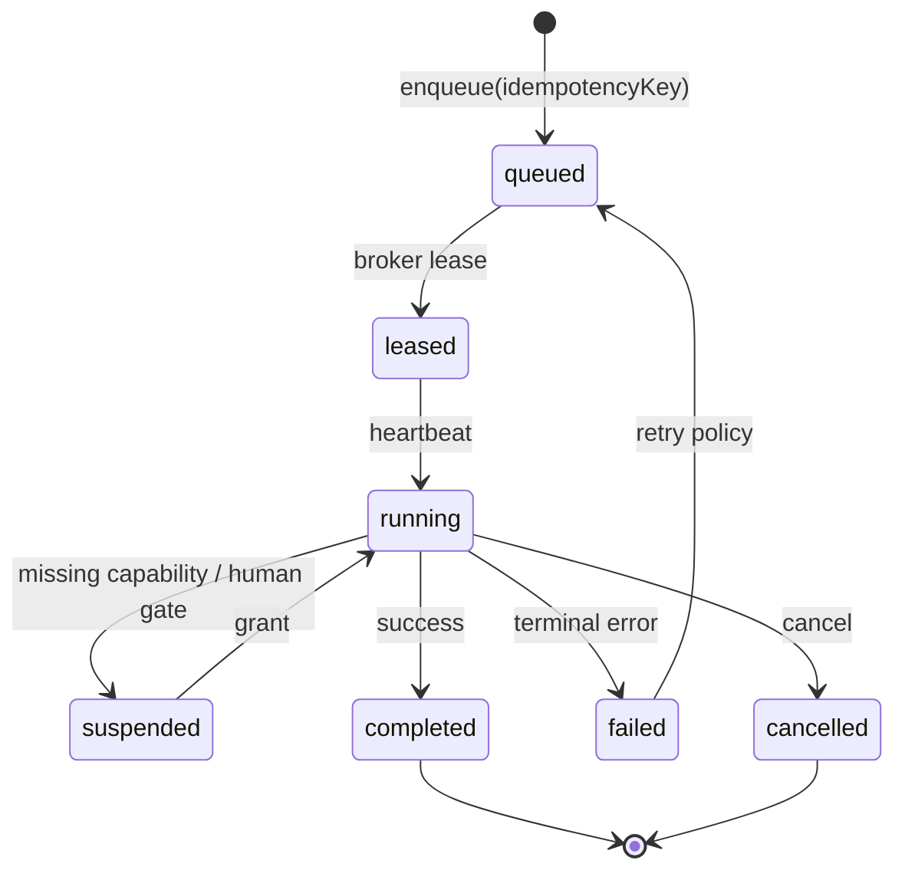

# Atlas vNext — Architecture Overview

Atlas vNext is a clean-room rebuild. Atlas Mountain and sibling products
(Caspa, ocrowley-commons, Life-os, Flipper/Marauder, OSINT shells) are
**behavioural references**. We keep proven correctness properties and port
test *cases*; we do not copy module graphs, god-objects, or deploy folklore.

The governing question for every design choice:

> What is the smallest boring structure that preserves the behaviour?

## 1. Non-negotiable rules

1. **Small, boring Nexus router.** Nexus resolves *what should handle this
   request* and nothing else. No retry loops, no threads, no polling, no
   domain logic, no vendor SDKs, no job execution.
2. **Separate execution broker.** All side effects — provider calls with
   failover, tool execution, job execution, fan-out — run in the broker.
   The router decides; the broker does.
3. **Durable jobs and projects.** Research jobs, investigation runs, writing
   commissions, OSINT lookups, device-relayed work, and website builds are
   all jobs under a project. No domain owns its own queue.
4. **Content-addressed storage (CAS).** Bytes live at `cas:sha256:<hex>`.
   Attachments, artifacts, snapshots, captures, and site previews are views
   over one store with a uniform provenance envelope.
5. **Event-driven progress.** Progress is an append-only event log with
   replay. Clients subscribe; they do not poll job rows.
6. **Explicit provenance.** Anything the system asserts carries source,
   retrieval time, and evidential status. Ad-hoc tool calls get the same
   envelope as pipeline results.
7. **Capability-based permissions.** Every side-effecting call presents a
   capability token at the broker choke point. Roles may *issue* capabilities;
   they are not checked at the execution boundary.
8. **Isolated domain modules (Dungeons).** Domains are plugins. They import
   `contracts` + `plugin-sdk` only. They never import each other, Nexus, or
   vendor adapters.
9. **Loopback core, authenticated edge.** Nexus/broker bind loopback.
   Pairing, SSO, rate limits, and device ingress live on the edge gateway.
10. **Observability, evaluation, backup, and transactional deploy are
    platform, not plugins.** Correlation ids, routing eval, snapshot/restore
    with key escrow, and canary+verify+rollback ship with the core.

## 2. System shape



### Chat / interactive path

1. Edge validates the session and attaches a capability set.
2. Nexus **normalizes the target once**, looks up the capability table,
   assembles policy (persona, posture, retrieval gating, budgets), and
   emits an `ExecutionIntent`.
3. Broker checks capabilities (suspending for a human grant if needed),
   runs the provider chain with the failover contract, executes approved
   tools, writes events and provenance, streams progress.
4. Nexus formats the event stream to the client. Nexus never calls a
   provider or a tool.

### Background path

Any domain enqueues a job against a project. The broker pool leases it
with heartbeats, idempotency keys, cancellation, and recovery. Progress
and completion are events. Restart mid-run is a drill, not a miracle.

## 3. Nexus (router discipline)

Nexus is a pure-ish resolver:

```text
(target, context, registry snapshot) → ExecutionIntent
```

An `ExecutionIntent` contains:

- canonical `capabilityId` (e.g. `nexus/reason`, `nexus/private`)
- ordered provider chain (ids only — no adapters)
- policy bundle (persona, posture, retrieval, local-only, budgets)
- correlation id
- the caller’s capability set (pass-through; Nexus does not enforce)

**Forbidden in Nexus:** vendor SDKs, HTTP to model providers, job stores,
retry/backoff, dungeon imports, filesystem I/O beyond config, tool
implementations, polling.

**Boot rule:** every capability primary and fallback must resolve to a
registered adapter *or* an explicitly declared `unconfigured` slot.
Otherwise Nexus refuses to boot. Silent fallback to a different vendor
is a defect.

**Size budget (enforced by tests):** production TypeScript in
`services/nexus` stays under **500 lines**, excluding tests. Domain logic
creep is a failed CI gate, not a code-review preference.

## 4. Execution broker

The broker is the only process allowed to:

- invoke a `ProviderAdapter`
- execute a tool or plugin
- mutate job state
- write blobs to CAS
- emit job/progress events
- mint or attenuate capabilities (via the issuer, at this choke point)

### Failover contract (ported behaviour)

Preserved verbatim from Atlas Mountain + Caspa:

1. Classify the task and intelligence mode.
2. Select the ordered chain from the intent (owned capacity first when
   the registry says it is healthy).
3. Bounded same-provider retry **only** when the error taxonomy marks
   the failure retryable *and* the operation is idempotent.
4. Billing/quota exhaustion is a **routing signal**, not a job failure.
   Quarantine the billing boundary; do not retry sibling models on the
   same bill.
5. Tool-call chunks are buffered until a provider completes successfully.
   Visible text commits the provider: **no failover after visible text**.
6. Local-only capabilities (`nexus/private`) never leave the local
   adapter set.
7. Recovery-fabric unavailability must never become a second outage.

Error taxonomy: `timeout | unavailable | abrupt_end` retryable;
`invalid_request | context_length | cancelled | permission_denied | billing`
terminal or routing-signal as specified.

## 5. Durable jobs and projects



- **Project** is the tenancy and retrieval unit: conversations, jobs,
  blobs, grants, and audit entries hang off it.
- **Job** is the unit of durable work. Types are plugin-declared
  (`writing.commission`, `investigation.run`, `osint.who`,
  `device.marauder.command`, …) but the state machine is platform-owned.
- **Idempotency keys** are required for enqueue.
- **Leases + heartbeats** survive broker restart.
- **Checkpoints** are CAS addresses, not opaque JSON blobs in the job row.

## 6. Content-addressed storage

Every stored byte is addressed as:

```text
cas:sha256:<64 lowercase hex>
```

The storage boundary API is:

```text
put(bytes, provenance) → ContentAddress
get(address) → bytes
stat(address) → digest, size, mediaType
link(projectId, role, address, provenance)
```

Path-based “save this attachment in the writing folder” APIs are illegal
at the package boundary. Views (attachment, artifact, snapshot, preview)
are `link` records over CAS, not separate stores.

GC and retention are broker jobs over `link` records, not dungeon
scripts.

## 7. Events

Envelope (see contracts):

- `id`, `sequence`, `occurredAt`
- `correlationId`, `projectId`, `jobId?`
- `type` (namespaced: `job.progress`, `job.suspended`, `nexus.resolved`, …)
- `payload` (typed per event)
- `provenance` (optional; required for evidential events)

Delivery: **at-least-once**. Consumers are idempotent on `id`.
SSE/WebSocket replay from `sequence`. No exactly-once promise.

## 8. Provenance and audit

Two layers:

1. **Evidential envelope** on claims, findings, blobs, and billed
   actions: `source`, `retrievedAt`, `method`, `evidentialStatus`
   (`primary | secondary | intelligence_lead | derived | unavailable`).
2. **Hash-chained audit ledger** (behaviour ported from
   `@ocrowley/audit` / Mn-Infrustructure): append-only, verifiable,
   covering capability grants, job state changes, restore drills, and
   OSINT lookups.

“Provenance before prose” is a platform invariant, not a writing-dungeon
feature.

## 9. Capability-based permissions

```text
Capability = {
  id,
  issuer,
  subject,          // user, device, job, plugin
  action,           // tool.execute, storage.put, provider.invoke, ...
  resource,         // project, blob, provider class, device
  attenuations,     // caveats: expiry, local-only, no-exfil, budget
  signature
}
```

- Default deny.
- Broker is the only enforcement point for side effects.
- Missing capability **suspends** the job/turn and waits for a human
  grant (ported from Atlas pending-permissions), rather than auto-allow
  or hard-fail by default.
- Guest / device / plugin tokens are attenuated copies, never ambient
  role checks at the call site.

Roles and Authentik groups may exist at the **edge** to *issue* tokens.
They must not appear on the broker execute signature.

## 10. Isolated domain modules (Dungeons)

Each dungeon is a plugin that declares:

- job types it can run
- tools it contributes
- UI panels (optional)
- required capabilities
- event types it emits (must be namespaced)

Allowed imports: `@atlas-vnext/contracts`, `@atlas-vnext/plugin-sdk`.

Illegal: another dungeon, `services/nexus`, vendor SDKs,
`@atlas-vnext/provider-spi` (broker-only), Atlas Mountain internals.

Reference plugin order after this gate: Investigation → Writing →
Research/OSINT → Device/Marauder → Website Studio → Quantum → Music.

Caspa remains a **consumer** of vNext jobs/events/recovery, not a
dungeon copied into this repo.

## 11. Out of scope until later gates

See [design-gate-report.md](./design-gate-report.md). In short: no
provider adapters, no dungeon implementations, no UI beyond stubs, no
deployers, no bulk port from Atlas Mountain or Caspa.
